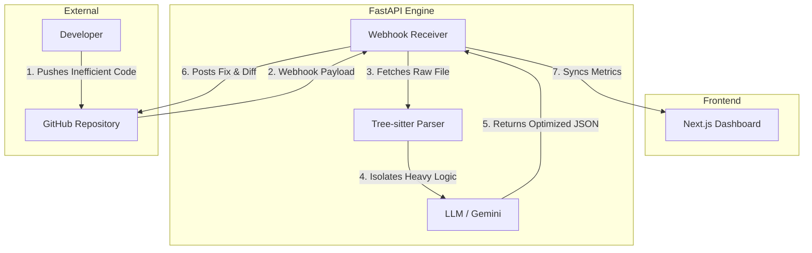

# 🌱 GreenCompute AI

**An Autonomous, Carbon-Aware CI/CD DevOps Agent for Sustainable Software Engineering.**

[](https://nextjs.org/)
[](https://fastapi.tiangolo.com/)
[](https://python.org/)
[](https://opensource.org/licenses/MIT)

---

## 📖 Overview

Data centers and software operations currently account for a significant portion of global greenhouse gas emissions. **GreenCompute AI** bridges the gap between software development and environmental sustainability. 

Designed as a drop-in integration for enterprise pipelines, it acts as an invisible CI/CD bot that autonomously reviews GitHub Pull Requests. By parsing the codebase using Abstract Syntax Trees (AST) to identify computationally expensive logic, it generates highly optimized, CPU-efficient code. By reducing execution time and routing infrastructure configurations based on real-time grid carbon intensity, it helps engineering teams drastically cut down their cloud carbon footprint without sacrificing development speed.

---

## ✨ Key Features

* **AST-Powered Profiling (Zero Hallucination):** Uses `tree-sitter` to parse code into an Abstract Syntax Tree, isolating only the problematic nodes (e.g., O(n²) loops) without hallucinating or modifying the core business logic.
* **Carbon-Aware Infrastructure Routing:** Integrates with real-time grid data (ElectricityMaps API) to rewrite Docker/Kubernetes YAML files, actively shifting heavy ML or build workloads to server regions currently powered by renewable energy.
* **Automated PR Interception:** Listens to GitHub Webhooks. When a developer pushes inefficient code, the bot automatically intercepts, analyzes, and pushes a deterministic fix as a PR comment or direct commit.
* **Premium Developer Dashboard:** A highly modular, dark-mode-only interface designed with a sleek, minimalist aesthetic. Features a Git-style Monaco diff viewer for seamless side-by-side code comparisons.

---

## 🏗️ System Architecture

GreenCompute AI operates on a **Split-Brain Architecture** to ensure the backend heavy-lifting doesn't bottleneck the user interface.

### Architecture Diagram


---
### The Agentic Engine (Backend)
* **Framework:** FastAPI (Python)
* **Core Logic:** Receives GitHub webhook payloads and fetches raw code via PyGithub.
* **Parser:** `tree-sitter` generates ASTs to extract isolated logic blocks.
* **AI Orchestration:** Passes isolated nodes to Large Language Models (Gemini/NVIDIA NIM) with strict JSON-enforced system prompts for deterministic code optimization.

### The Command Center (Frontend)
* **Framework:** Next.js (App Router), React, TypeScript.
* **Styling:** Tailwind CSS (Strict dark mode, high-contrast, utility-first).
* **Visualization:** Integrates `@monaco-editor/react` to render syntax-highlighted diffs.

## 🛠️ Tech Stack

| Category | Technologies Used |
| :--- | :--- |
| **Frontend** | Next.js, React, TypeScript, Tailwind CSS, Lucide React, Monaco Editor |
| **Backend** | Python 3.10+, FastAPI, Uvicorn, Pydantic |
| **Parsers & APIs** | `tree-sitter`, PyGithub, ElectricityMaps API |
| **AI Integration** | Google AI Studio (Gemini) / NVIDIA NIM |

## 🚀 Local Setup & Installation

### Prerequisites
* Node.js (v18+)
* Python (3.10+)
* Git
* `ngrok` (for local webhook testing)

### 1. Backend Setup (FastAPI)
```bash
# Navigate to the backend directory
cd backend

# Create and activate a virtual environment
python -m venv venv
source venv/bin/activate  # On Windows use: venv\Scripts\activate

# Install dependencies
pip install -r requirements.txt

# Create a .env file and add your API keys
echo "GITHUB_TOKEN=your_token_here" >> .env
echo "GEMINI_API_KEY=your_token_here" >> .env

# Run the server
uvicorn main:app --reload
```

### 2. Frontend Setup (Next.js)
```bash
# Navigate to the frontend directory
cd frontend

# Install dependencies
npm install

# Run the development server
npm run dev
```

### 3. Webhook Configuration (Local Testing)
1. Run `ngrok http 8000` to expose your local FastAPI server.
2. Go to your GitHub Repository -> Settings -> Webhooks.
3. Add a new webhook with the Payload URL: `https://<your-ngrok-url>/api/webhook/github`.
4. Set Content type to `application/json` and trigger on Pull Requests.

## 🔄 How It Works (The Workflow)
1. **Developer Pushes Code:** A developer raises a PR containing a nested for-loop (high CPU cycle cost).
2. **Webhook Trigger:** GitHub sends a payload to the GreenCompute FastAPI backend.
3. **AST Extraction:** `tree-sitter` parses the `.py` or `.js` file, identifying the inefficient loop node.
4. **AI Optimization:** The node is sent to the LLM. The AI returns an optimized, O(n) HashMap approach in strict JSON format.
5. **Automated Review:** PyGithub posts the optimized code diff directly back to the GitHub PR thread.
6. **Dashboard Sync:** The Next.js dashboard updates the "Total CPU Cycles Saved" metric in real-time.

## 👨‍💻 Author
**Shivadutt Singh** Lead Developer & Architect  
*Built for the future of sustainable software engineering.*

## 🛡️ License
Distributed under the MIT License. See `LICENSE` for more information.
